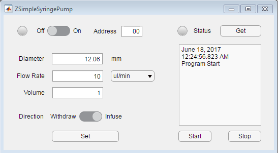

# ZSimpleSyringePump
## v0.0.1

A simple GUI for NewEra (or other OEM pump, e.g., Braintree, Aladdin) syringe pump.

### Dependency
This program is based on MATLAB App Designer. MATLAB 2016a or later version is required.

### Usage
- Connect pump to computer with RS-232 (RS-232 to USB Converter might be preferable)
- Set the BitRate to 19200 on the pump
- Double click to start the program
